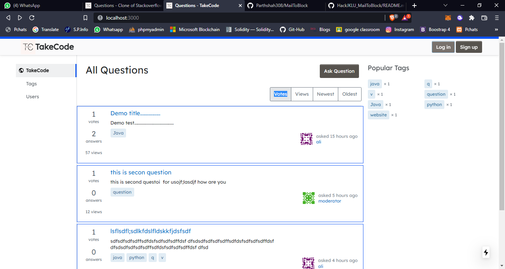
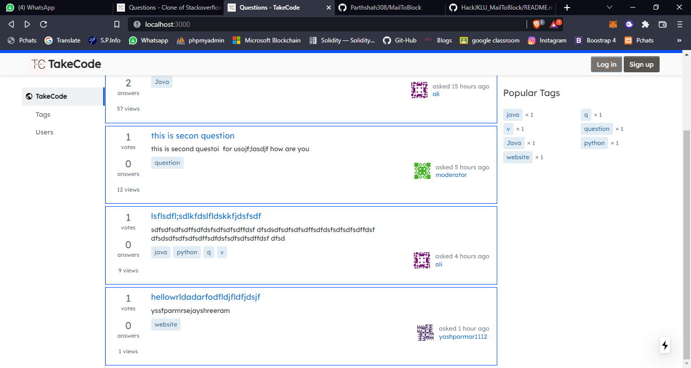
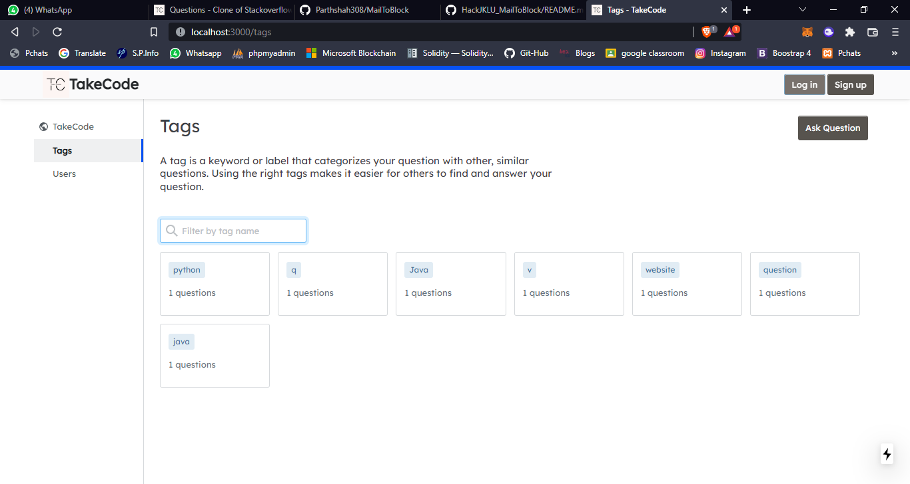
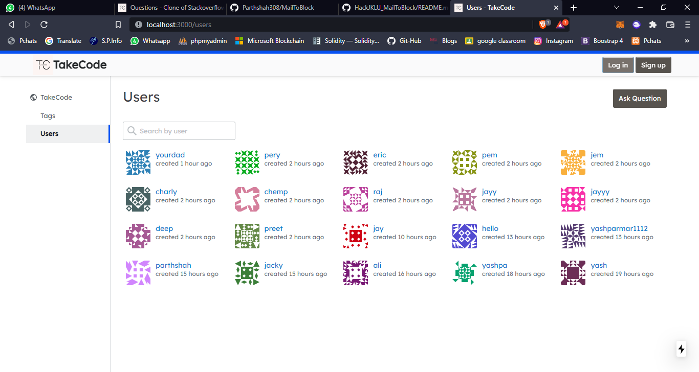
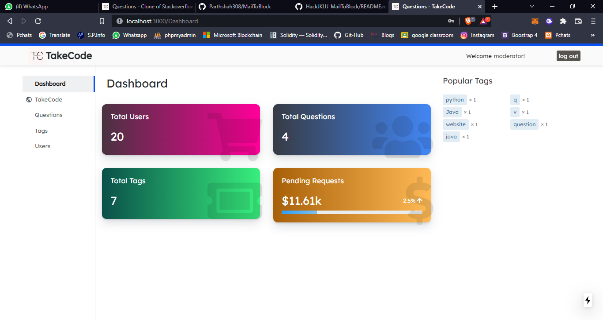
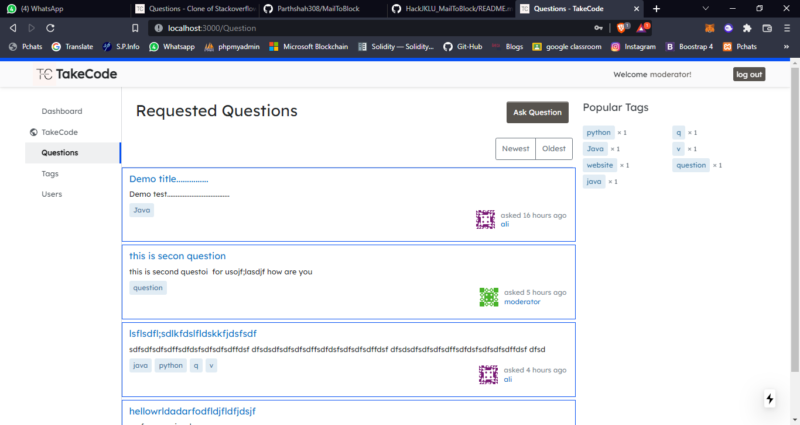
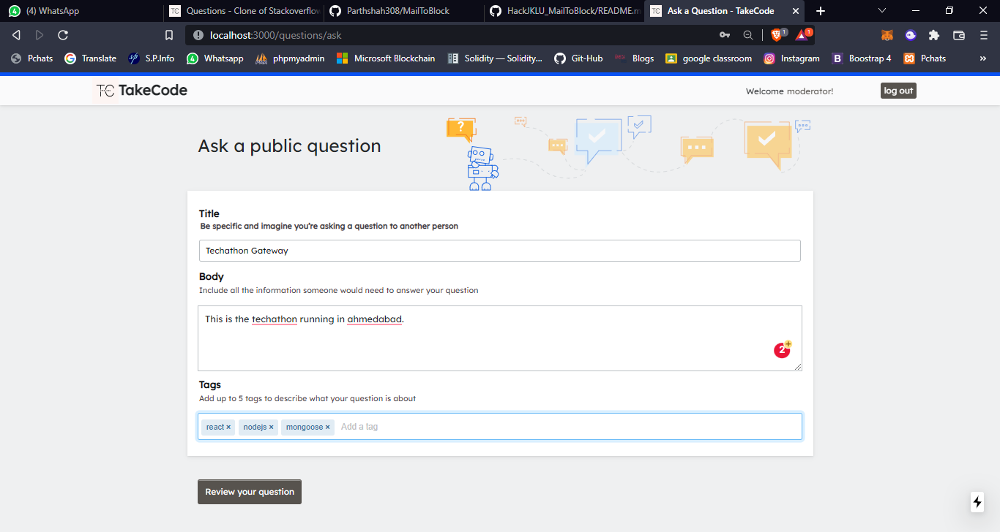
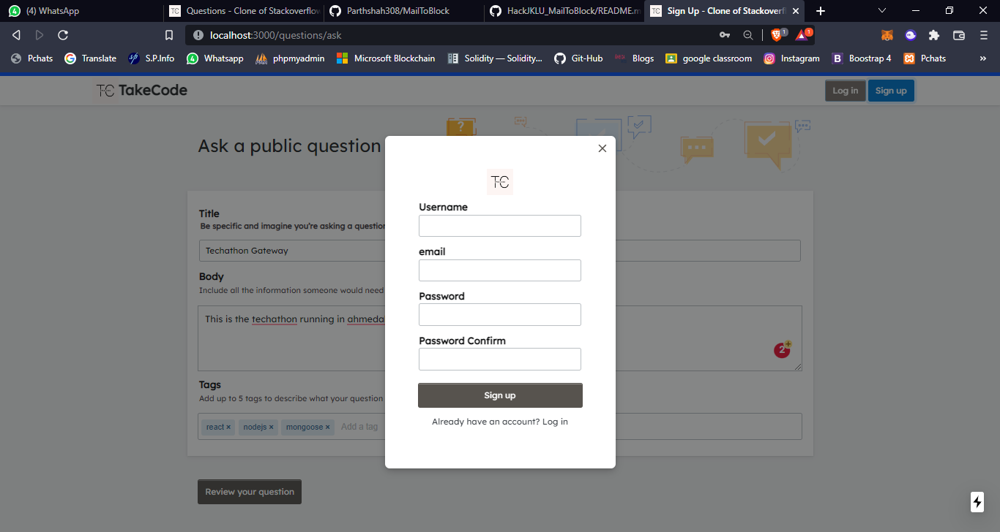
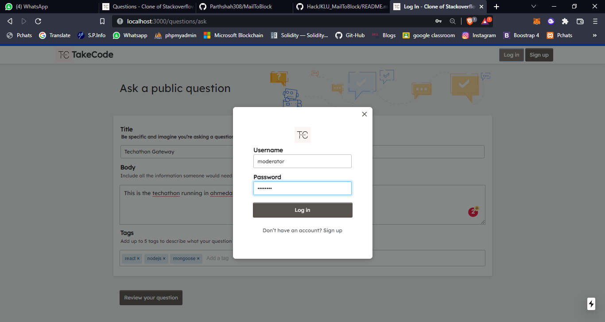
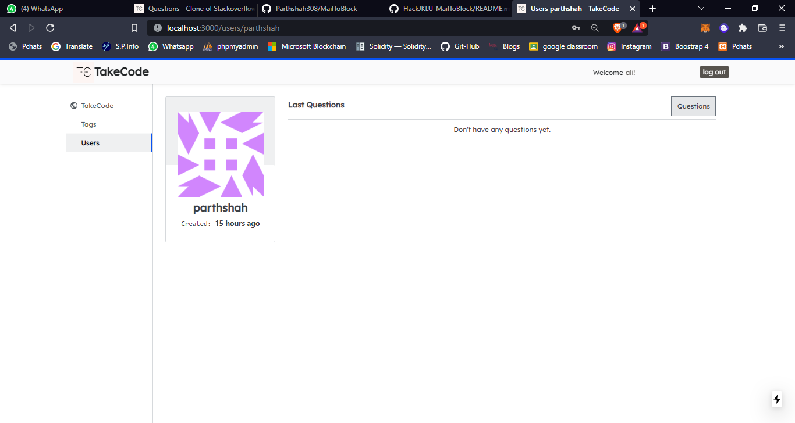

# Demo
### [🚀 ViewDemo](https://techathon-morning.vercel.app/)

# TechCode

- TechCode is a Tech forum .
- Allows users to post a challenge(questions) that will be generated and approved & rejected by moderator via admin panel.

============> Moderator login credential:
-  username: moderator
- password: admin12345

## Functionalities:
- User Registration
- User Login
- Moderator Login
- Push Mail Notification
- Ask Question modal
- Other users can add answer it.
- Other users can add comments.
- User can approve the answer.
- Moderator can approve/reject the answer.
- Moderator & user can be delete the question.
- UpVotes/DownVotes the answer
- Filters (Votes,Views,Newest,Oldest)
- Question Views count
- Differences types of Tages
- Profile Page
- Admin Dashboard
- Authentication System.

## Happy Flow of the TackCode 

- Put Challenge
Any individual user can register into the Systems with basic details.
- Any registered user can put challenge(questions) into the takeCode forum.
- Requested challenge (questions) will be send to the moderator for approval.
- Moderator can view requested challenges and can take action for the send.
- Moderator can approval or reject challenge after review.
- Once challenge is being approved by moderator it will be displayed on the take code forum.
- Now, Challenge (questions) is submitted by user is publically available on the forum.
- Other users can view the challenge and can add the answer.

## API Reference

We use nodeJS api and deploy on heroku.

*API* - https://takecode.herokuapp.com

## Tech Stack

*Client:* Next Js , TailwindCSS

*Backend:* NodeJS, ExpressJS

*DataBase:* Mongoose, MailGun

*hosting:* vercel,heroku,github

## Authors

- [@parthshah308](https://www.github.com/parthshah308)
- [@Yash-1511](https://www.github.com/yash-1511)

## Feedback

If you have any feedback, please reach out to us LinkedIn profile below here.
- [@parthshah308](https://www.linkedin.com/in/parth-shah-22aba6224/)
- [@Yash-1511](https://www.linkedin.com/in/yash-parmar-26744b211/)

## Screenshots

